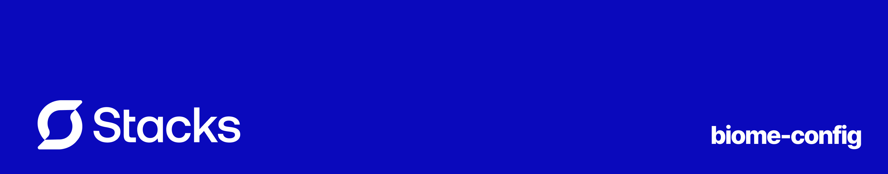

<p align="center"></p>

[![npm version][npm-version-src]][npm-version-href]
[](http://commitizen.github.io/cz-cli/)
<!-- [![npm downloads][npm-downloads-src]][npm-downloads-href] -->
<!-- [![Codecov][codecov-src]][codecov-href] -->

# biome-config

This is an opinionated, well-defined Biome configuration to help you get started with your project. ~~It currently is the configuration used by [Stacks.js](https://stacksjs.org).~~ We are using [Pickier](https://github.com/stacksjs/pickier) at the moment.

## Features

- Preconfigured linter & formatter settings
- Customizable TypeScript, JavaScript, JSON & CSS rules
- Automatic import organization
- EditorConfig support enabled by default
- Git integration
- Predefined ignore patterns for common files/directories

## Get Started

```bash
bun i @stacksjs/biome-config
```

After you installed the config, you need to extend it in your `biome.json` file.

```jsonc
{
  "$schema": "./node_modules/@biomejs/biome/configuration_schema.json",

  // add your custom configuration here

  "extends": ["@stacksjs/biome-config"]
}
```

_You want to tweak some of the rules? You can easily override them._

## Changelog

Please see our [releases](https://github.com/stackjs/biome-config/releases) page for more information on what has changed recently.

## Contributing

Please see [CONTRIBUTING](.github/CONTRIBUTING.md) for details.

## Community

For help, discussion about best practices, or any other conversation that would benefit from being searchable:

[Discussions on GitHub](https://github.com/stacksjs/biome-config/discussions)

For casual chit-chat with others using this package:

[Join the Stacks Discord Server](https://discord.gg/stacksjs)

## Postcardware

Stacks OSS will always stay open-sourced, and we will always love to receive postcards from wherever Stacks is used! _And we also publish them on our website. Thank you, Spatie._

Our address: Stacks.js, 12665 Village Lane #2306, Playa Vista 90094, CA, USA 🌎

## Sponsors

We would like to extend our thanks to the following sponsors for funding Stacks development. If you are interested in becoming a sponsor, please reach out to us.

- [JetBrains](https://www.jetbrains.com/)
- [The Solana Foundation](https://solana.com/)

## 📄 License

The MIT License (MIT). Please see [LICENSE](LICENSE.md) for more information.

Made with 💙

<!-- Badges -->
[npm-version-src]: https://img.shields.io/npm/v/@stacksjs/biome-config?style=flat-square
[npm-version-href]: https://npmjs.com/package/@stacksjs/biome-config

<!-- [codecov-src]: https://img.shields.io/codecov/c/gh/stacksjs/biome-config/main?style=flat-square
[codecov-href]: https://codecov.io/gh/stacksjs/biome-config -->
